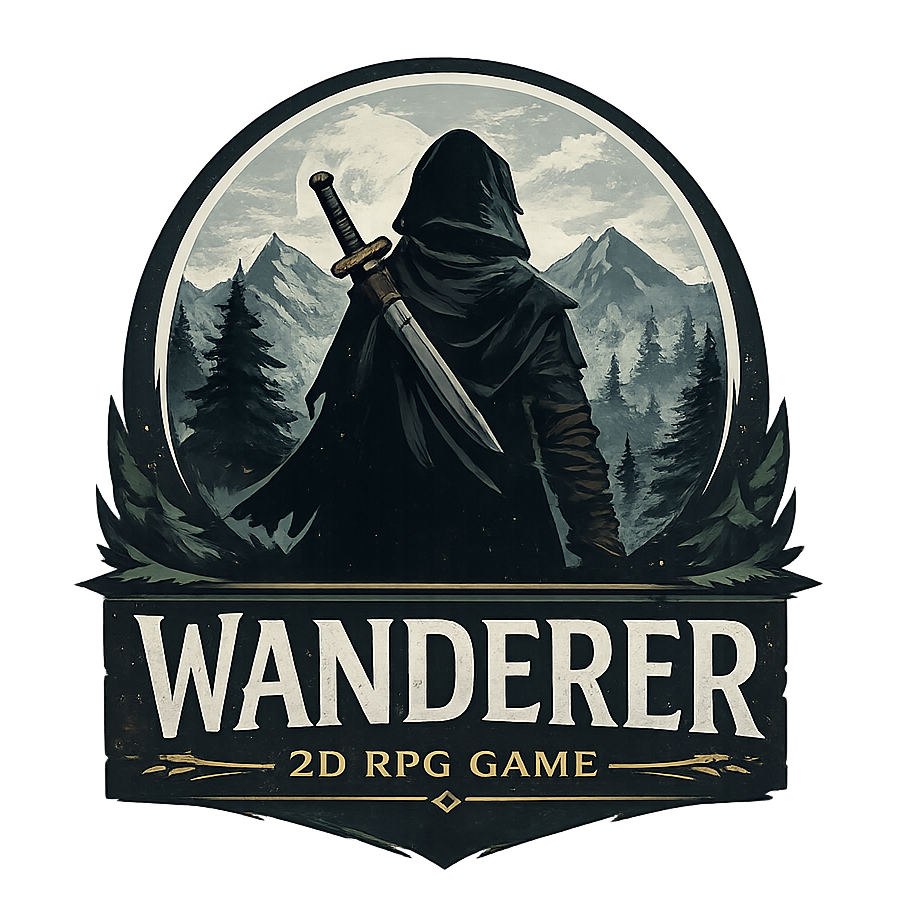

# Wanderer

A small 2D top-down action-RPG built in **Rust** with the [`macroquad`](https://github.com/not-fl3/macroquad) game framework, made as the final project for a Rust workshop.



## Gameplay

You wake up near an old ruined outpost. A traveling elder warns you that wolves have overrun the area — talk to them to accept the quest, then hunt down the wolves before they hunt you.

- Explore a hand-painted world (river, forest, farm, and a ruined outpost).
- Fight wolves with a randomized 3-hit attack combo.
- Take damage, get knocked back into a hurt animation, and — if your HP hits zero — a full death animation plays before the Game Over screen.
- Complete the quest by defeating 3 wolves to trigger a "Quest Complete" banner.
- Wolves spread out and approach from different angles instead of stacking on top of each other or on top of you.

## Controls

| Key | Action |
|---|---|
| `W` `A` `S` `D` | Move |
| `Space` | Attack |
| `E` | Talk to NPC / advance dialogue |
| `Enter` | Restart after Game Over |
| Mouse | Click menu buttons / (in-game) prints world coordinates to the console, used for collision calibration |

## Project structure

```
src/
├── main.rs        # window config, icon embedding, game loop
├── game.rs         # top-level state machine: menu, playing, game over
├── state.rs        # GameState / MenuButton enums
├── player.rs        # movement, HP, animations (idle/run/attack/hurt/death)
├── enemy.rs         # wolf AI: chase, spread out, attack, death
├── npc.rs         # dialogue-driven quest giver
├── quest.rs        # quest progress tracking
├── world.rs         # static background map + manually placed collision rectangles
├── animation.rs     # sprite-sheet animation player (looping and one-shot)
├── camera.rs        # 2D camera setup
├── constants.rs     # all tunable gameplay constants
├── map.rs, tile.rs, object.rs, item.rs, utils.rs  # earlier procedural-map experiments, kept for reference
```

The world is a single painted background image (`assets/maps/map_background.png`) with hand-placed `Rect` colliders in `world.rs` (river banks, the farmhouse, and the ruined outpost walls) rather than a tile-based collision grid.

## Assets

- Background art, player, NPC, and wolf sprites: pixel art (see `assets/`).
- `menu_theme.wav`: original chiptune composition for the main menu.
- `forest_ambience.wav`: synthesized wind/bird ambience for exploration.
- `hit.wav`, `complete.wav`: combat and quest-completion feedback.
- Window icon: generated from an original "WANDERER" logo, embedded directly into the binary.

## Building & running

```bash
cargo run --release
```

Requires the Rust toolchain (`rustup`) and a graphics-capable environment (macroquad uses OpenGL).

## Known limitations

- Wolves path directly toward the player and don't navigate around obstacles — if you stand behind a wall, they may get stuck trying to reach you in a straight line.
- The "Continue", "Options", and "Credits" main menu buttons are placeholders and not yet implemented.
- No save/load system yet.

## Credits

Built by [Pooriya](https://github.com/koktel141) as a Rust workshop final project.
